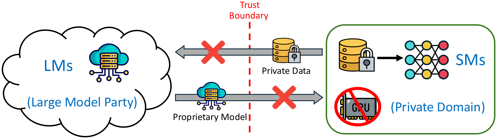
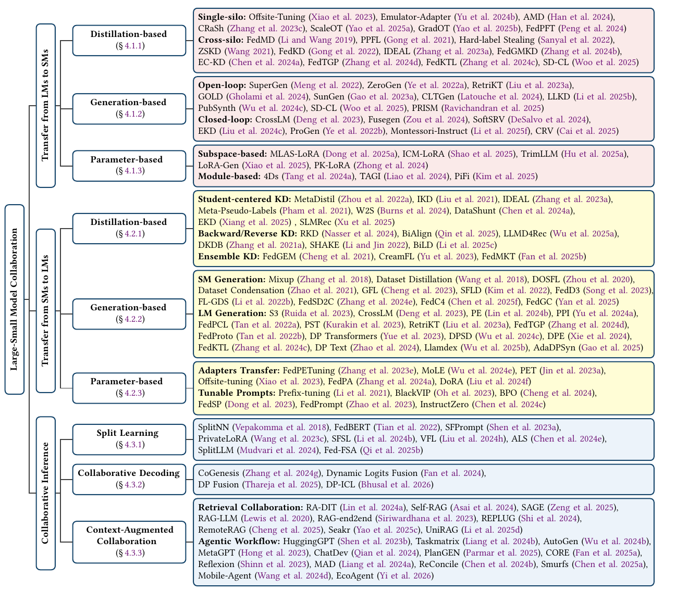

<div align=center>

# Awesome LM-SM Domain Collaboration

[](https://opensource.org/licenses/MIT)
[](http://makeapullrequest.com)
[](https://arxiv.org/abs/2504.17421)
[](https://github.com/KejiaZhang-Robust/Awesome-LM-SM-Domain-Collaboration)

<p>
  <a href="https://arxiv.org/abs/2504.17421"><strong>[Paper]</strong></a>
  &nbsp;&nbsp;
  <a href="#-contents"><strong>[Contents]</strong></a>
  &nbsp;&nbsp;
</p>



</div>

> **Towards Harnessing the Collaborative Power of Large and Small Models for Domain Tasks** [[arXiv]](https://arxiv.org/abs/2504.17421)
>
> [Yang Liu](https://sites.google.com/site/yangliuveronica/)<sup>†,\*,1</sup>, [Kejia Zhang](https://kejiazhang-robust.github.io/homepage)<sup>\*,1,2</sup>, [Bingjie Yan](https://www.bj-yan.top/)<sup>1</sup>, [Tianyuan Zou](https://scholar.google.com/citations?user=vlV8sCQAAAAJ&hl=en&oi=ao)<sup>2</sup>, [Jianqing Zhang](https://scholar.google.com/citations?user=lppe2vwAAAAJ&hl=en&oi=ao)<sup>2,3</sup>, [Zixuan Gu](https://openreview.net/profile?id=~Zixuan_GU1)<sup>2</sup>, [XIANGSEN CHEN](https://xschen-beb.github.io/)<sup>1</sup>, Jianbing Ding<sup>4</sup>, Xidong Wang<sup>4</sup>, Jingyi Li<sup>4</sup>, [Xiaozhou Ye](https://www.asiainfo.com/en_us/preview_about.html)<sup>4</sup>, [Ye Ouyang](https://air.tsinghua.edu.cn/en/info/1047/1890.htm)<sup>4</sup>, [Qiang Yang](https://www.polyu.edu.hk/dsai/people/academic-staff/yang-qiang/?sc_lang=en)<sup>1</sup>, [Ya-Qin Zhang](https://air.tsinghua.edu.cn/en/info/1046/1188.htm)<sup>2</sup>
>
> <sup>1</sup>The Hong Kong Polytechnic University, <sup>2</sup>Institute for AI Industry Research, Tsinghua University, <sup>3</sup>Shanghai Jiao Tong University, <sup>4</sup>AsiaInfo Technologies
>
> \* Equal Contribution. † Corresponding Author (yang-veronica.liu@polyu.edu.hk).

> [!TIP]
> If this repository or our survey paper helps your work, please consider citing it.
>
> We also welcome [pull requests](https://github.com/KejiaZhang-Robust/Awesome-LM-SM-Domain-Collaboration/pulls) and [issues](https://github.com/KejiaZhang-Robust/Awesome-LM-SM-Domain-Collaboration/issues) for missing papers, metadata fixes, taxonomy improvements, and content clarification.

```bibtex
@article{liu2025towards,
  title={Towards Harnessing the Collaborative Power of Large and Small Models for Domain Tasks},
  author={Liu, Yang and Yan, Bingjie and Zou, Tianyuan and Zhang, Jianqing and Gu, Zixuan and Ding, Jianbing and Wang, Xidong and Li, Jingyi and Ye, Xiaozhou and Ouyang, Ye and others},
  journal={arXiv preprint arXiv:2504.17421},
  year={2025}
}
```

## 🔥 News

- [2026-02-11] Initial release: this repository is now publicly available.

## 🎯 Motivation

> Domain tasks often involve private data, proprietary models, and limited local resources, which make centralized adaptation of large models impractical. LM-SM collaboration addresses this setting by combining the broad generalization of large models with the efficiency and locality of small models. This repository organizes representative methods by transfer direction and inference-time collaboration, with attention to privacy, model security, and resource constraints.

## Taxonomy

<div align="center">

</div>

---

## 📚 Contents

<p>
<a href="#knowledge-transfer-from-lms-to-sms"></a> <a href="subpages/LM2SM.md">Subpage</a><br>
<a href="#knowledge-transfer-from-sms-to-lms"></a> <a href="subpages/SM2LM.md">Subpage</a><br>
<a href="#cross-silo-collaborative-inference"></a> <a href="subpages/Collaborative.md">Subpage</a>
</p>

<details>
<summary><strong>Badge legend</strong></summary>

<br>

-  `arXiv papers`
-  `conference/journal papers`
-  `code repository stars`
-  `method categories`

</details>

<a id="knowledge-transfer-from-lms-to-sms"></a>
###  Knowledge Transfer from LMs to SMs

<details open>
<summary><strong>Distillation-based Transfer</strong></summary>

| **Title & Authors**                                                                                                                                                                                                                                                                                                                                                                                                                                                                                                                                                                    |      **Method**       |                                                              **Category**                                                              | **Links**                                                                                                                                                        |
| -------------------------------------------------------------------------------------------------------------------------------------------------------------------------------------------------------------------------------------------------------------------------------------------------------------------------------------------------------------------------------------------------------------------------------------------------------------------------------------------------------------------------------------------------------------------------------------- | :-------------------: | :------------------------------------------------------------------------------------------------------------------------------------: | ---------------------------------------------------------------------------------------------------------------------------------------------------------------- |
| [](https://arxiv.org/abs/1910.03581) [](https://arxiv.org/abs/1910.03581) [](https://github.com/diogenes0319/FedMD_clean)<br>[FedMD: Heterogenous Federated Learning via Model Distillation](https://arxiv.org/abs/1910.03581)<br>Daliang Li, Junpu Wang                                                                   |        `FedMD`        |    | [Paper](https://arxiv.org/abs/1910.03581)<br>[Code](https://github.com/diogenes0319/FedMD_clean)                                                                 |
| [](https://openaccess.thecvf.com/content/ICCV2021/html/Gong_Ensemble_Attention_Distillation_for_Privacy-Preserving_Federated_Learning_ICCV_2021_paper.html)<br>[Ensemble Attention Distillation for Privacy-Preserving Federated Learning](https://openaccess.thecvf.com/content/ICCV2021/html/Gong_Ensemble_Attention_Distillation_for_Privacy-Preserving_Federated_Learning_ICCV_2021_paper.html)<br>Xuan Gong, Abhishek Sharma, Srikrishna Karanam, et al.                                            |        `PPFL`         |    | [Paper](https://openaccess.thecvf.com/content/ICCV2021/html/Gong_Ensemble_Attention_Distillation_for_Privacy-Preserving_Federated_Learning_ICCV_2021_paper.html) |
| [](https://arxiv.org/abs/2106.03310) [](https://arxiv.org/abs/2106.03310) [](https://github.com/zwang84/zsdb3kd)<br>[Zero-Shot Knowledge Distillation from a Decision-Based Black-Box Model](https://arxiv.org/abs/2106.03310)<br>Zi Wang                                                                                                         |        `ZSKD`         |    | [Paper](https://arxiv.org/abs/2106.03310)<br>[Code](https://github.com/zwang84/zsdb3kd)                                                                          |
| [](https://arxiv.org/abs/2209.04599) [](https://arxiv.org/abs/2209.04599)<br>[Preserving Privacy in Federated Learning with Ensemble Cross-Domain Knowledge Distillation](https://arxiv.org/abs/2209.04599)<br>Xuan Gong, Abhishek Sharma, Srikrishna Karanam, et al.                                                                                                                                                                     |        `FedKD`        |    | [Paper](https://arxiv.org/abs/2209.04599)                                                                                                                        |
| [](https://arxiv.org/abs/2204.11022) [](https://arxiv.org/abs/2204.11022) [](https://github.com/val-iisc/Hard-Label-Model-Stealing)<br>[Towards Data-Free Model Stealing in a Hard Label Setting](https://arxiv.org/abs/2204.11022)<br>Sunandini Sanyal, Sravanti Addepalli, R Venkatesh Babu                                  | `Hard-label Stealing` |    | [Paper](https://arxiv.org/abs/2204.11022)<br>[Code](https://github.com/val-iisc/Hard-Label-Model-Stealing)                                                       |
| [](https://arxiv.org/abs/2302.04870) [](https://github.com/mit-han-lab/offsite-tuning)<br>[Offsite-Tuning: Transfer Learning without Full Model](https://arxiv.org/abs/2302.04870)<br>Guangxuan Xiao, Ji Lin, Song Han                                                                                                                                                                                               |   `Offsite-Tuning`    |  | [Paper](https://arxiv.org/abs/2302.04870)<br>[Code](https://github.com/mit-han-lab/offsite-tuning)                                                               |
| [](https://arxiv.org/abs/2310.15477) [](https://arxiv.org/abs/2310.15477)<br>[CRaSh: Clustering, Removing, and Sharing Enhance Fine-Tuning without Full Large Language Model](https://arxiv.org/abs/2310.15477)<br>Kai-yan Zhang, Ning Ding, Biqing Qi, et al.                                                                                                                                                                           |        `CRaSh`        |  | [Paper](https://arxiv.org/abs/2310.15477)                                                                                                                        |
| [](https://arxiv.org/abs/2205.11158) [](https://arxiv.org/abs/2205.11158) [](https://github.com/SonyResearch/IDEAL)<br>[IDEAL: Query-Efficient Data-Free Learning from Black-Box Models](https://arxiv.org/abs/2205.11158)<br>Jie Zhang, et al.                                                                                                |        `IDEAL`        |    | [Paper](https://arxiv.org/abs/2205.11158)<br>[Code](https://github.com/SonyResearch/IDEAL)                                                                       |
| [](https://ojs.aaai.org/index.php/AAAI/article/view/29003) [](https://github.com/Anfeather/Data-Shunt)<br>[Data Shunt: Collaboration of Small and Large Models for Lower Costs and Better Performance](https://ojs.aaai.org/index.php/AAAI/article/view/29003)<br>Dong Chen, Yueting Zhuang, Shuo Zhang, et al.                                                                                             |        `EC-KD`        |    | [Paper](https://ojs.aaai.org/index.php/AAAI/article/view/29003)<br>[Code](https://github.com/Anfeather/Data-Shunt)                                               |
| [](https://arxiv.org/abs/2401.03230) [](https://arxiv.org/abs/2401.03230) [](https://github.com/TsingZ0/FedTGP)<br>[FedTGP: Trainable Global Prototypes with Adaptive-Margin-Enhanced Contrastive Learning for Data and Model Heterogeneity in Federated Learning](https://arxiv.org/abs/2401.03230)<br>Jianqing Zhang, Yang Liu, Yang Hua, et al. |       `FedTGP`        |    | [Paper](https://arxiv.org/abs/2401.03230)<br>[Code](https://github.com/TsingZ0/FedTGP)                                                                           |
| [](https://arxiv.org/abs/2403.15760) [](https://arxiv.org/abs/2403.15760) [](https://github.com/TsingZ0/FedKTL)<br>[An Upload-Efficient Scheme for Transferring Knowledge from a Server-Side Pre-Trained Generator to Clients in Heterogeneous Federated Learning](https://arxiv.org/abs/2403.15760)<br>Jianqing Zhang, Yang Liu, Yang Hua, et al. |       `FedKTL`        |    | [Paper](https://arxiv.org/abs/2403.15760)<br>[Code](https://github.com/TsingZ0/FedKTL)                                                                           |
| [](https://arxiv.org/abs/2407.04208) [](https://arxiv.org/abs/2407.04208)<br>[AMD: Automatic Multi-Step Distillation of Large-Scale Vision Models](https://arxiv.org/abs/2407.04208)<br>Cheng Han, Qifan Wang, Sohail A Dianat, et al.                                                                                                                                                                                                    |         `AMD`         |  | [Paper](https://arxiv.org/abs/2407.04208)                                                                                                                        |
| [](https://arxiv.org/abs/2310.17492) [](https://arxiv.org/abs/2310.17492)<br>[Orchestration of Emulator Assisted 6G Mobile Edge Tuning for AI Foundation Models: A Multi-Agent Deep Reinforcement Learning Approach](https://arxiv.org/abs/2310.17492)<br>Wenhan Yu, Terence Jie Chua, Jun Zhao                                                                                                                                     |  `Emulator-Adapter`   |  | [Paper](https://arxiv.org/abs/2310.17492)                                                                                                                        |
| [](https://arxiv.org/abs/2404.11536) [](https://arxiv.org/abs/2404.11536)<br>[FedPFT: Federated Proxy Fine-Tuning of Foundation Models](https://arxiv.org/abs/2404.11536)<br>Zhaopeng Peng, Xiaoliang Fan, Yufan Chen, et al.                                                                                                                                                                                                            |       `FedPFT`        |  | [Paper](https://arxiv.org/abs/2404.11536)                                                                                                                        |
| [](https://proceedings.neurips.cc/paper_files/paper/2024/hash/d6520fa7f71dc8e09ed5939a60a64218-Abstract-Conference.html)<br>[FedGMKD: An Efficient Prototype Federated Learning Framework Through Knowledge Distillation and Discrepancy-Aware Aggregation](https://proceedings.neurips.cc/paper_files/paper/2024/hash/d6520fa7f71dc8e09ed5939a60a64218-Abstract-Conference.html)<br>Jian-qiao Zhang, Cai-feng Shan, Jungong Han                                                                      |       `FedGMKD`       |    | [Paper](https://proceedings.neurips.cc/paper_files/paper/2024/hash/d6520fa7f71dc8e09ed5939a60a64218-Abstract-Conference.html)                                    |
| [](https://arxiv.org/abs/2412.09812) [](https://arxiv.org/abs/2412.09812)<br>[ScaleOT: Privacy-Utility-Scalable Offsite-Tuning with Dynamic LayerReplace and Selective Rank Compression](https://arxiv.org/abs/2412.09812)<br>Kai Yao, zhaorui Tan, Tiandi Ye, et al.                                                                                                                                                                     |       `ScaleOT`       |  | [Paper](https://arxiv.org/abs/2412.09812)                                                                                                                        |
| [](https://arxiv.org/abs/2507.04455) [](https://arxiv.org/abs/2507.04455)<br>[GradOT: Training-Free Gradient-Preserving Offsite-Tuning for Large Language Models](https://arxiv.org/abs/2507.04455)<br>Kai Yao, Zhaorui Tan, Penglei Gao, et al.                                                                                                                                                                                           |       `GradOT`        |  | [Paper](https://arxiv.org/abs/2507.04455)                                                                                                                        |
| [](https://www.nature.com/articles/s41746-025-01681-4)<br>[Synthetic Data Distillation Enables the Extraction of Clinical Information at Scale](https://www.nature.com/articles/s41746-025-01681-4)<br>Elizabeth Geena Woo, Michael C Burkhart, Emily Alsentzer, et al.                                                                                                                                                                                                              |        `SD-CL`        |    | [Paper](https://www.nature.com/articles/s41746-025-01681-4)                                                                                                      |

<p align="right">(<a href="#-contents">back to top ↑</a>)</p>

</details>

<details open>
<summary><strong>Generation-based Transfer</strong></summary>

| **Title & Authors**                                                                                                                                                                                                                                                                                                                                                                                                                                                                                                                                            |      **Method**       |                                                            **Category**                                                            | **Links**                                                                                                                        |
| -------------------------------------------------------------------------------------------------------------------------------------------------------------------------------------------------------------------------------------------------------------------------------------------------------------------------------------------------------------------------------------------------------------------------------------------------------------------------------------------------------------------------------------------------------------- | :-------------------: | :--------------------------------------------------------------------------------------------------------------------------------: | -------------------------------------------------------------------------------------------------------------------------------- |
| [](https://arxiv.org/abs/2202.07922) [](https://arxiv.org/abs/2202.07922) [](https://github.com/jiacheng-ye/ZeroGen)<br>[ZeroGen: Efficient Zero-Shot Learning via Dataset Generation](https://arxiv.org/abs/2202.07922)<br>Jiacheng Ye, Jiahui Gao, Qintong Li, et al.                                              |       `ZeroGen`       |      | [Paper](https://arxiv.org/abs/2202.07922)<br>[Code](https://github.com/jiacheng-ye/ZeroGen)                                      |
| [](https://arxiv.org/abs/2210.12329) [](https://arxiv.org/abs/2210.12329) [](https://github.com/HKUNLP/ProGen)<br>[ProGen: Progressive Zero-Shot Dataset Generation via in-Context Feedback](https://arxiv.org/abs/2210.12329)<br>Jiacheng Ye, Jiahui Gao, Zhiyong Wu, et al.                                    |       `ProGen`        |  | [Paper](https://arxiv.org/abs/2210.12329)<br>[Code](https://github.com/HKUNLP/ProGen)                                            |
| [](https://arxiv.org/abs/2202.04538) [](https://arxiv.org/abs/2202.04538) [](https://github.com/yumeng5/SuperGen)<br>[Generating Training Data with Language Models: Towards Zero-Shot Language Understanding](https://arxiv.org/abs/2202.04538)<br>Yu Meng, Jiaxin Huang, Yu Zhang, et al.                           |      `SuperGen`       |      | [Paper](https://arxiv.org/abs/2202.04538)<br>[Code](https://github.com/yumeng5/SuperGen)                                         |
| [](https://arxiv.org/abs/2312.05842)<br>[Mutual Enhancement of Large and Small Language Models with Cross-Silo Knowledge Transfer](https://arxiv.org/abs/2312.05842)<br>Yongheng Deng, Ziqing Qiao, Ju Ren, et al.                                                                                                                                                                                                                                                                              |       `CrossLM`       |  | [Paper](https://arxiv.org/abs/2312.05842)                                                                                        |
| [](https://arxiv.org/abs/2310.15594) [](https://arxiv.org/abs/2310.15594)<br>[Retrieval-Based Knowledge Transfer: An Effective Approach for Extreme Large Language Model Compression](https://arxiv.org/abs/2310.15594)<br>Jiduan Liu, Jiahao Liu, Qifan Wang, et al.                                                                                                                                  |       `RetriKT`       |      | [Paper](https://arxiv.org/abs/2310.15594)                                                                                        |
| [](https://arxiv.org/abs/2205.12679) [](https://arxiv.org/abs/2205.12679) [](https://github.com/SumilerGAO/SunGen)<br>[Self-Guided Noise-Free Data Generation for Efficient Zero-Shot Learning](https://arxiv.org/abs/2205.12679)<br>Jiahui Gao, Renjie Pi, Lin Yong, et al.                                            |       `SunGen`        |      | [Paper](https://arxiv.org/abs/2205.12679)<br>[Code](https://github.com/SumilerGAO/SunGen)                                        |
| [](https://arxiv.org/abs/2410.16534)<br>[No More Hard Prompts: SoftSRV Prompting for Synthetic Data Generation](https://arxiv.org/abs/2410.16534v2)<br>Giulia DeSalvo, Jean-Fracois Kagy, Lazaros Karydas, et al.                                                                                                                                                                                                                                                                               |       `SoftSRV`       |  | [Paper](https://arxiv.org/abs/2410.16534v2)                                                                                      |
| [](https://arxiv.org/abs/2403.06414) [](https://arxiv.org/abs/2403.06414)<br>[Evolving Knowledge Distillation with Large Language Models and Active Learning](https://arxiv.org/abs/2403.06414)<br>Chengyuan Liu, Fubang Zhao, Kun Kuang, et al.                                                                                                                                                                |         `EKD`         |  | [Paper](https://arxiv.org/abs/2403.06414)                                                                                        |
| [](https://arxiv.org/abs/2404.04360) [](https://arxiv.org/abs/2404.04360)<br>[Prompt Public Large Language Models to Synthesize Data for Private On-device Applications](https://arxiv.org/abs/2404.04360)<br>Shanshan Wu, Zheng Xu, Yanxiang Zhang, et al.                                                                                                                                                       |      `PubSynth`       |      | [Paper](https://arxiv.org/abs/2404.04360)                                                                                        |
| [](https://arxiv.org/abs/2406.12527) [](https://arxiv.org/abs/2406.12527) [](https://github.com/LindaLydia/FuseGen)<br>[Fusegen: PLM Fusion for Data-Generation Based Zero-Shot Learning](https://arxiv.org/abs/2406.12527)<br>Tianyuan Zou, Yang Liu, Peng Li, et al.                                                |       `Fusegen`       |  | [Paper](https://arxiv.org/abs/2406.12527)<br>[Code](https://github.com/LindaLydia/FuseGen)                                       |
| [](https://arxiv.org/abs/2407.11854) [](https://arxiv.org/abs/2407.11854)<br>[Zero-Shot Cross-Lingual Transfer for Synthetic Data Generation in Grammatical Error Detection](https://arxiv.org/abs/2407.11854)<br>Gaetan Latouche, Marc-André Carbonneau, Ben Swanson                                                                                                                                            |       `CLTGen`        |      | [Paper](https://arxiv.org/abs/2407.11854)                                                                                        |
| [](https://arxiv.org/abs/2403.19754) [](https://arxiv.org/abs/2403.19754) [](https://github.com/vbdi/gold)<br>[GOLD: Generalized Knowledge Distillation via Out-of-Distribution-Guided Language Data Generation](https://arxiv.org/abs/2403.19754)<br>Mohsen Gholami, Mohammad Akbari, Tianxi Hu, et al.             |        `GOLD`         |      | [Paper](https://arxiv.org/abs/2403.19754)<br>[Code](https://github.com/vbdi/gold)                                                |
| [](https://arxiv.org/abs/2506.17486) [](https://arxiv.org/abs/2506.17486) [](https://github.com/KumarRobotics/PRISM)<br>[Distilling On-device Language Models for Robot Planning with Minimal Human Intervention](https://arxiv.org/abs/2506.17486)<br>Zachary Ravichandran, Ignacio Hounie, Fernando Cladera, et al. |        `PRISM`        |      | [Paper](https://arxiv.org/abs/2506.17486)<br>[Code](https://github.com/KumarRobotics/PRISM)                                      |
| [](https://arxiv.org/abs/2504.09802) [](https://arxiv.org/abs/2504.09802)<br>[Enhancing Reasoning Abilities of Small LLMs with Cognitive Alignment](https://arxiv.org/abs/2504.09802)<br>Wenrui Cai, Chengyu Wang, Junbing Yan, et al.                                                                                                                                                                           |         `CRV`         |  | [Paper](https://arxiv.org/abs/2504.09802)                                                                                        |
| [](https://arxiv.org/abs/2410.14208) [](https://arxiv.org/abs/2410.14208) [](https://github.com/cxcscmu/Montessori-Instruct)<br>[Montessori-Instruct: Generate Influential Training Data Tailored for Student Learning](https://arxiv.org/abs/2410.14208)<br>Xiaochuan Li, Zichun Yu, Chenyan Xiong           | `Montessori-Instruct` |  | [Paper](https://arxiv.org/abs/2410.14208)<br>[Code](https://github.com/cxcscmu/Montessori-Instruct)                              |
| [](https://arxiv.org/abs/2411.08028v1) [](https://arxiv.org/abs/2411.08028) [](https://github.com/SeonggwanKo/LLKD)<br>[Learning with Less: Knowledge Distillation from Large Language Models via Unlabeled Data](https://arxiv.org/abs/2411.08028v1)<br>Juanhui Li, Sreyashi Nag, Hui Liu, et al.            |        `LLKD`         |      | [Paper](https://arxiv.org/abs/2411.08028v1)<br>[Code](https://github.com/SeonggwanKo/LLKD)                                       |
| [](https://www.nature.com/articles/s41746-025-01681-4) [](https://github.com/bbj-lab/clinical-synthetic-data-distil)<br>[Synthetic Data Distillation Enables the Extraction of Clinical Information at Scale](https://www.nature.com/articles/s41746-025-01681-4)<br>Elizabeth Geena Woo, Michael C Burkhart, Emily Alsentzer, et al.         |        `SD-CL`        |      | [Paper](https://www.nature.com/articles/s41746-025-01681-4)<br>[Code](https://github.com/bbj-lab/clinical-synthetic-data-distil) |

<p align="right">(<a href="#-contents">back to top ↑</a>)</p>

</details>

<details open>
<summary><strong>Parameter-based Transfer</strong></summary>

| **Title & Authors**                                                                                                                                                                                                                                                                                                                                                                                                                                                                                                                                                       | **Method**  |                                                             **Category**                                                             | **Links**                                                                                             |
| ------------------------------------------------------------------------------------------------------------------------------------------------------------------------------------------------------------------------------------------------------------------------------------------------------------------------------------------------------------------------------------------------------------------------------------------------------------------------------------------------------------------------------------------------------------------------- | :---------: | :----------------------------------------------------------------------------------------------------------------------------------: | ----------------------------------------------------------------------------------------------------- |
| [](https://arxiv.org/abs/2401.06826) [](https://arxiv.org/abs/2401.06826)<br>[Direct Distillation Between Different Domains](https://arxiv.org/abs/2401.06826)<br>Jialiang Tang, Shuo Chen, Gang Niu, et al.                                                                                                                                                                                                                 |    `4Ds`    |      | [Paper](https://arxiv.org/abs/2401.06826)                                                             |
| [](https://arxiv.org/abs/2310.11451) [](https://arxiv.org/abs/2310.11451) [](https://github.com/maszhongming/ParaKnowTransfer)<br>[Seeking Neural Nuggets: Knowledge Transfer in Large Language Models from a Parametric Perspective](https://arxiv.org/abs/2310.11451)<br>Ming Zhong, Chenxin An, Weizhu Chen, et al. |  `PK-LoRA`  |  | [Paper](https://arxiv.org/abs/2310.11451)<br>[Code](https://github.com/maszhongming/ParaKnowTransfer) |
| [](https://arxiv.org/abs/2406.12382) [](https://arxiv.org/abs/2406.12382) [](https://github.com/Xnhyacinth/TAGI)<br>[From Instance Training to Instruction Learning: Task Adapters Generation from Instructions](https://arxiv.org/abs/2406.12382)<br>Huanxuan Liao, Shizhu He, Yao Xu, et al.                                    |   `TAGI`    |      | [Paper](https://arxiv.org/abs/2406.12382)<br>[Code](https://github.com/Xnhyacinth/TAGI)               |
| [](https://aclanthology.org/2025.acl-long.762/)<br>[MLAS-LoRA: Language-Aware Parameters Detection and Lora-Based Knowledge Transfer for Multilingual Machine Translation](https://aclanthology.org/2025.acl-long.762/)<br>Tianyu Dong, Bo Li, Jinsong Liu, et al.                                                                                                                                                                                                                           | `MLAS-LoRA` |  | [Paper](https://aclanthology.org/2025.acl-long.762/)                                                  |
| [](https://arxiv.org/abs/2506.07424) [](https://arxiv.org/abs/2506.07424)<br>[Plug-in and Fine-tuning: Bridging the Gap between Small Language Models and Large Language Models](https://arxiv.org/abs/2506.07424)<br>Kyeonghyun Kim, Jinhee Jang, Juhwan Choi, et al.                                                                                                                                                        |   `PiFi`    |      | [Paper](https://arxiv.org/abs/2506.07424)                                                             |
| [](https://arxiv.org/abs/2412.11242) [](https://arxiv.org/abs/2412.11242)<br>[TrimLLM: Progressive Layer Dropping for Domain-Specific LLMs](https://arxiv.org/abs/2412.11242)<br>Lanxiang Hu, Tajana Rosing, Hao Zhang                                                                                                                                                                                                        |  `TrimLLM`  |  | [Paper](https://arxiv.org/abs/2412.11242)                                                             |
| [](https://arxiv.org/abs/2506.11638) [](https://arxiv.org/abs/2506.11638)<br>[LoRA-Gen: Specializing Large Language Model via Online LoRA Generation](https://arxiv.org/abs/2506.11638)<br>Yicheng Xiao, Lin Song, Rui Yang, et al.                                                                                                                                                                                          | `LoRA-Gen`  |  | [Paper](https://arxiv.org/abs/2506.11638)                                                             |
| [](https://arxiv.org/abs/2501.17635) [](https://arxiv.org/abs/2501.17635)<br>[In-Context Meta LoRA Generation](https://arxiv.org/abs/2501.17635)<br>Yihua Shao, Minxi Yan, Yang Liu, et al.                                                                                                                                                                                                                                 | `ICM-LoRA`  |  | [Paper](https://arxiv.org/abs/2501.17635)                                                             |

<p align="right">(<a href="#-contents">back to top ↑</a>)</p>

</details>

<a id="knowledge-transfer-from-sms-to-lms"></a>
###  Knowledge Transfer from SMs to LMs

<details open>
<summary><strong>Distillation-based Transfer</strong></summary>

| **Title & Authors**                                                                                                                                                                                                                                                                                                                                                                                                                                                                                                                                                                                                 |      **Method**      |                                                         **Category**                                                         | **Links**                                                                                                                                                                 |
| ------------------------------------------------------------------------------------------------------------------------------------------------------------------------------------------------------------------------------------------------------------------------------------------------------------------------------------------------------------------------------------------------------------------------------------------------------------------------------------------------------------------------------------------------------------------------------------------------------------------- | :------------------: | :--------------------------------------------------------------------------------------------------------------------------: | ------------------------------------------------------------------------------------------------------------------------------------------------------------------------- |
| [](https://arxiv.org/abs/2110.11027)<br>[FedGEMS: Federated Learning of Larger Server Models via Selective Knowledge Fusion](https://arxiv.org/abs/2110.11027)<br>Sijie Cheng, Jingwen Wu, Yanghua Xiao, et al.                                                                                                                                                                                                                                                                                                                                      |       `FedGEM`       |                   | [Paper](https://arxiv.org/abs/2110.11027)                                                                                                                                 |
| [](https://arxiv.org/abs/2109.04641)<br>[Learning to Teach with Student Feedback](https://arxiv.org/abs/2109.04641)<br>Yi-tao Liu, Tian-xiang Sun, Xi-peng Qiu, et al.                                                                                                                                                                                                                                                                                                                                                                               |        `IKD`         |  | [Paper](https://arxiv.org/abs/2109.04641)                                                                                                                                 |
| [](https://arxiv.org/abs/2003.10580) [](https://arxiv.org/abs/2003.10580) [](https://github.com/kekmodel/MPL-pytorch)<br>[Meta Pseudo Labels](https://arxiv.org/abs/2003.10580)<br>Hieu Pham, Zihang Dai, Qizhe Xie, et al.                                                                                                                                               | `Meta-Pseudo-Labels` |  | [Paper](https://arxiv.org/abs/2003.10580)<br>[Code](https://github.com/kekmodel/MPL-pytorch)                                                                              |
| [](https://ieeexplore.ieee.org/abstract/document/9534396)<br>[Dual Knowledge Distillation for Bidirectional Neural Machine Translation](https://ieeexplore.ieee.org/abstract/document/9534396)<br>Huaao Zhang, Shigui Qiu, Shilong Wu                                                                                                                                                                                                                                                                                                |        `DKDB`        |   | [Paper](https://ieeexplore.ieee.org/abstract/document/9534396)                                                                                                            |
| [](https://arxiv.org/abs/2106.04570) [](https://arxiv.org/abs/2106.04570) [](https://github.com/JetRunner/MetaDistil)<br>[BERT Learns to Teach: Knowledge Distillation with Meta Learning](https://arxiv.org/abs/2106.04570)<br>Wangchunshu Zhou, Canwen Xu, Julian McAuley                                                                                                |     `MetaDistil`     |  | [Paper](https://arxiv.org/abs/2106.04570)<br>[Code](https://github.com/JetRunner/MetaDistil)                                                                              |
| [](https://proceedings.neurips.cc/paper_files/paper/2022/hash/040d3b6af368bf71f952c18da5713b48-Abstract-Conference.html) [](https://github.com/lliai/SHAKE)<br>[Shadow Knowledge Distillation: Bridging Offline and Online Knowledge Transfer](https://proceedings.neurips.cc/paper_files/paper/2022/hash/040d3b6af368bf71f952c18da5713b48-Abstract-Conference.html)<br>Lujun Li, Zhe Jin                                                      |       `SHAKE`        |   | [Paper](https://proceedings.neurips.cc/paper_files/paper/2022/hash/040d3b6af368bf71f952c18da5713b48-Abstract-Conference.html)<br>[Code](https://github.com/lliai/SHAKE)   |
| [](https://arxiv.org/abs/2205.11158) [](https://arxiv.org/abs/2205.11158) [](https://github.com/SonyResearch/IDEAL)<br>[IDEAL: Query-Efficient Data-Free Learning from Black-Box Models](https://arxiv.org/abs/2205.11158)<br>Jie Zhang, et al.                                                                                                                             |       `IDEAL`        |  | [Paper](https://arxiv.org/abs/2205.11158)<br>[Code](https://github.com/SonyResearch/IDEAL)                                                                                |
| [](https://arxiv.org/abs/2302.08888) [](https://arxiv.org/abs/2302.08888) [](https://github.com/FLAIR-THU/CreamFL)<br>[Multimodal Federated Learning via Contrastive Representation Ensemble](https://arxiv.org/abs/2302.08888)<br>Qiying Yu, Yang Liu, Yimu Wang, et al.                                                                                                    |      `CreamFL`       |                   | [Paper](https://arxiv.org/abs/2302.08888)<br>[Code](https://github.com/FLAIR-THU/CreamFL)                                                                                 |
| [](https://ojs.aaai.org/index.php/AAAI/article/view/29003) [](https://github.com/Anfeather/Data-Shunt)<br>[DataShunt: Collaboration of Small and Large Models for Lower Costs and Better Performance](https://ojs.aaai.org/index.php/AAAI/article/view/29003)<br>Dong Chen, Yueting Zhuang, Shuo Zhang, et al.                                                                                                                           |     `DataShunt`      |  | [Paper](https://ojs.aaai.org/index.php/AAAI/article/view/29003)<br>[Code](https://github.com/Anfeather/Data-Shunt)                                                        |
| [](https://arxiv.org/abs/2312.09390) [](https://arxiv.org/abs/2312.09390)<br>[Weak-To-Strong Generalization: Eliciting Strong Capabilities with Weak Supervision](https://arxiv.org/abs/2312.09390)<br>Collin Burns, et al.                                                                                                                                                                                                                                            |        `W2S`         |  | [Paper](https://arxiv.org/abs/2312.09390)                                                                                                                                 |
| [](https://arxiv.org/abs/2307.10698) [](https://arxiv.org/abs/2307.10698) [](https://github.com/NiharGupte/ReverseKnowledgeDistillation)<br>[Reverse Knowledge Distillation: Training a Large Model Using a Small One for Retinal Image Matching on Limited Data](https://arxiv.org/abs/2307.10698)<br>Sahar Almahfouz Nasser, Nihar Gupte, Amit Sethi |        `RKD`         |   | [Paper](https://arxiv.org/abs/2307.10698)<br>[Code](https://github.com/NiharGupte/ReverseKnowledgeDistillation)                                                           |
| [](https://arxiv.org/abs/2312.17055) [](https://arxiv.org/abs/2312.17055)<br>[Beyond Output Matching: Bidirectional Alignment for Enhanced in-Context Learning](https://arxiv.org/abs/2312.17055)<br>Chengwei Qin, Wenhan Xia, Fangkai Jiao, et al.                                                                                                                                                                                                                     |      `BiAlign`       |   | [Paper](https://arxiv.org/abs/2312.17055)                                                                                                                                 |
| [](https://arxiv.org/abs/2505.18120)<br>[Bidirectional Knowledge Distillation for Enhancing Sequential Recommendation with Large Language Models](https://arxiv.org/abs/2505.18120)<br>Jiongran Wu, Jiahao Liu, Dongsheng Li, et al.                                                                                                                                                                                                                                                                                                                 |      `LLMD4Rec`      |   | [Paper](https://arxiv.org/abs/2505.18120)                                                                                                                                 |
| [](https://arxiv.org/abs/2406.13555) [](https://arxiv.org/abs/2406.13555) [](https://github.com/fpcsong/BiLD)<br>[BiLD: Bi-Directional Logits Difference Loss for Large Language Model Distillation](https://arxiv.org/abs/2406.13555)<br>Minchong Li, Feng Zhou, Xiaohui Song                                                                                                  |        `BiLD`        |   | [Paper](https://arxiv.org/abs/2406.13555)<br>[Code](https://github.com/fpcsong/BiLD)                                                                                      |
| [](https://arxiv.org/abs/2406.02224) [](https://arxiv.org/abs/2406.02224) [](https://github.com/FederatedAI/FATE-LLM)<br>[FedMKT: Federated Mutual Knowledge Transfer for Large and Small Language Models](https://arxiv.org/abs/2406.02224)<br>Tao Fan, Guoqiang Ma, Yan Kang, et al.                                                                                  |       `FedMKT`       |                   | [Paper](https://arxiv.org/abs/2406.02224)<br>[Code](https://github.com/FederatedAI/FATE-LLM/tree/main/python/fate_llm/algo/fedmkt)                                        |
| [](https://openaccess.thecvf.com/content/ICCV2025/html/Xiang_Evidential_Knowledge_Distillation_ICCV_2025_paper.html) [](https://github.com/lyxiang-casia/EKD)<br>[Evidential Knowledge Distillation](https://openaccess.thecvf.com/content/ICCV2025/html/Xiang_Evidential_Knowledge_Distillation_ICCV_2025_paper.html)<br>Liangyu Xiang, Junyu Gao, Changsheng Xu                                                                           |        `EKD`         |  | [Paper](https://openaccess.thecvf.com/content/ICCV2025/html/Xiang_Evidential_Knowledge_Distillation_ICCV_2025_paper.html)<br>[Code](https://github.com/lyxiang-casia/EKD) |
| [](https://arxiv.org/abs/2405.17890) [](https://arxiv.org/abs/2405.17890) [](https://github.com/WujiangXu/SLMRec)<br>[SLMRec: Distilling Large Language Models into Small for Sequential Recommendation](https://arxiv.org/abs/2405.17890)<br>Wujiang Xu, Qitian Wu, Zujie Liang, et al.                                                                                      |       `SLMRec`       |  | [Paper](https://arxiv.org/abs/2405.17890)<br>[Code](https://github.com/WujiangXu/SLMRec)                                                                                  |

<p align="right">(<a href="#-contents">back to top ↑</a>)</p>

</details>

<details open>
<summary><strong>Generation-based Transfer</strong></summary>

| **Title & Authors**                                                                                                                                                                                                                                                                                                                                                                                                                                                                                                                                                                                                                          |       **Method**       |                                                  **Category**                                                   | **Links**                                                                                                                                                                   |
| -------------------------------------------------------------------------------------------------------------------------------------------------------------------------------------------------------------------------------------------------------------------------------------------------------------------------------------------------------------------------------------------------------------------------------------------------------------------------------------------------------------------------------------------------------------------------------------------------------------------------------------------- | :--------------------: | :-------------------------------------------------------------------------------------------------------------: | --------------------------------------------------------------------------------------------------------------------------------------------------------------------------- |
| [](https://arxiv.org/abs/1811.10959) [](https://github.com/ssnl/dataset-distillation)<br>[Dataset Distillation](https://arxiv.org/abs/1811.10959)<br>Tongzhou Wang, Jun-Yan Zhu, Antonio Torralba, et al.                                                                                                                                                                                                                                                                   | `Dataset Distillation` |  | [Paper](https://arxiv.org/abs/1811.10959)<br>[Code](https://github.com/ssnl/dataset-distillation)                                                                           |
| [](https://arxiv.org/abs/1710.09412) [](https://arxiv.org/abs/1710.09412) [](https://github.com/facebookresearch/mixup-cifar10)<br>[Mixup: Beyond Empirical Risk Minimization](https://arxiv.org/abs/1710.09412)<br>Hongyi Zhang, Moustapha Cisse, Yann N. Dauphin, et al.                                                                                                               |        `Mixup`         |  | [Paper](https://arxiv.org/abs/1710.09412)<br>[Code](https://github.com/facebookresearch/mixup-cifar10)                                                                      |
| [](https://arxiv.org/abs/2009.07999)<br>[Distilled One-Shot Federated Learning](https://arxiv.org/abs/2009.07999)<br>Yanlin Zhou, George Pu, Xiyao Ma, et al.                                                                                                                                                                                                                                                                                                                                                                                                                 |        `DOSFL`         |  | [Paper](https://arxiv.org/abs/2009.07999)                                                                                                                                   |
| [](https://arxiv.org/abs/2006.05929) [](https://arxiv.org/abs/2006.05929) [](https://github.com/VICO-UoE/DatasetCondensation)<br>[Dataset Condensation with Gradient Matching](https://arxiv.org/abs/2006.05929)<br>Bo Zhao, et al.                                                                                                                                                        | `Dataset Condensation` |  | [Paper](https://arxiv.org/abs/2006.05929)<br>[Code](https://github.com/VICO-UoE/DatasetCondensation)                                                                        |
| [](https://arxiv.org/abs/2105.00243) [](https://arxiv.org/abs/2105.00243) [](https://github.com/yuetan031/FedProto)<br>[FedProto: Federated Prototype Learning Across Heterogeneous Clients](https://arxiv.org/abs/2105.00243)<br>Yue Tan, et al.                                                                                                                                                    |       `FedProto`       |  | [Paper](https://arxiv.org/abs/2105.00243)<br>[Code](https://github.com/yuetan031/FedProto)                                                                                  |
| [](https://arxiv.org/abs/2206.05507) [](https://arxiv.org/abs/2206.05507)<br>[Federated Learning with Gan-Based Data Synthesis for Non-IID Clients](https://arxiv.org/abs/2206.05507)<br>Zi-jian Li, Jia-wei Shao, Yu-yi Mao, et al.                                                                                                                                                                                              |        `FL-GDS`        |  | [Paper](https://arxiv.org/abs/2206.05507)                                                                                                                                   |
| [](https://scholar.google.com/scholar?hl=en&as_sdt=0%2C5&q=Stable+federated+learning+with+dataset+condensation&btnG=) [](https://github.com/bigdata-inha/FedDC)<br>[Stable Federated Learning with Dataset Condensation](https://scholar.google.com/scholar?hl=en&as_sdt=0%2C5&q=Stable+federated+learning+with+dataset+condensation&btnG=)<br>Seong-Woong Kim, et al.                                                                                              |         `SFLD`         |  | [Paper](https://scholar.google.com/scholar?hl=en&as_sdt=0%2C5&q=Stable+federated+learning+with+dataset+condensation&btnG=)<br>[Code](https://github.com/bigdata-inha/FedDC) |
| [](https://arxiv.org/abs/2209.10083) [](https://arxiv.org/abs/2209.10083) [](https://github.com/yuetan031/FedPCL)<br>[Federated Learning from Pre-Trained Models: A Contrastive Learning Approach](https://arxiv.org/abs/2209.10083)<br>Yue Tan, Guodong Long, Jie Ma, et al.                                                                                                                       |        `FedPCL`        |  | [Paper](https://arxiv.org/abs/2209.10083)<br>[Code](https://github.com/yuetan031/FedPCL)                                                                                    |
| [](https://arxiv.org/abs/2210.14348) [](https://arxiv.org/abs/2210.14348)<br>[Synthetic Text Generation with Differential Privacy: A Simple and Practical Recipe](https://arxiv.org/abs/2210.14348)<br>Xiang Yue, Huseyin Inan, Xuechen Li, et al.                                                                                                                                                                                                                                               |   `DP Transformers`    |  | [Paper](https://arxiv.org/abs/2210.14348)                                                                                                                                   |
| [](https://arxiv.org/abs/2306.01684)<br>[Harnessing Large-Language Models to Generate Private Synthetic Text](https://arxiv.org/abs/2306.01684)<br>Alexey Kurakin, Natalia Ponomareva, Umar Syed, et al.                                                                                                                                                                                                                                                                                                                                                                      |         `PST`          |  | [Paper](https://arxiv.org/abs/2306.01684)                                                                                                                                   |
| [](https://arxiv.org/abs/2312.05842)<br>[Mutual Enhancement of Large and Small Language Models with Cross-Silo Knowledge Transfer](https://arxiv.org/abs/2312.05842)<br>Yongheng Deng, Ziqing Qiao, Ju Ren, et al.                                                                                                                                                                                                                                                                                                                                                            |       `CrossLM`        |  | [Paper](https://arxiv.org/abs/2312.05842)                                                                                                                                   |
| [](https://arxiv.org/abs/2310.13671) [](https://arxiv.org/abs/2310.13671) [](https://github.com/RickySkywalker/Synthesis_Step-by-Step_Official)<br>[Let's Synthesize Step by Step: Iterative Dataset Synthesis with Large Language Models by Extrapolating Errors from Small Models](https://arxiv.org/abs/2310.13671)<br>WANG Ruida, Wangchunshu Zhou, Mrinmaya Sachan |          `S3`          |  | [Paper](https://arxiv.org/abs/2310.13671)<br>[Code](https://github.com/RickySkywalker/Synthesis_Step-by-Step_Official)                                                      |
| [](https://arxiv.org/abs/2310.15594) [](https://arxiv.org/abs/2310.15594)<br>[Retrieval-Based Knowledge Transfer: An Effective Approach for Extreme Large Language Model Compression](https://arxiv.org/abs/2310.15594)<br>Jiduan Liu, Jiahao Liu, Qifan Wang, et al.                                                                                                                                                                                                                |       `RetriKT`        |  | [Paper](https://arxiv.org/abs/2310.15594)                                                                                                                                   |
| [](https://arxiv.org/abs/2208.11311) [](https://arxiv.org/abs/2208.11311)<br>[Federated Learning via Decentralized Dataset Distillation in Resource-Constrained Edge Environments](https://arxiv.org/abs/2208.11311)<br>Rui Song, Dai Liu, Dave Zhenyu Chen, et al.                                                                                                                                                                                                                            |        `FedD3`         |  | [Paper](https://arxiv.org/abs/2208.11311)                                                                                                                                   |
| [](https://ieeexplore.ieee.org/document/10099110)<br>[GFL: Federated Learning on Non-IID Data via Privacy-Preserving Synthetic Data](https://ieeexplore.ieee.org/document/10099110)<br>Yihang Cheng, Lan Zhang, Anran Li                                                                                                                                                                                                                                                                                                                                     |         `GFL`          |  | [Paper](https://ieeexplore.ieee.org/document/10099110)                                                                                                                      |
| [](https://arxiv.org/abs/2401.03230) [](https://arxiv.org/abs/2401.03230) [](https://github.com/TsingZ0/FedTGP)<br>[FedTGP: Trainable Global Prototypes with Adaptive-Margin-Enhanced Contrastive Learning for Data and Model Heterogeneity in Federated Learning](https://arxiv.org/abs/2401.03230)<br>Jianqing Zhang, Yang Liu, Yang Hua, et al.                                                       |        `FedTGP`        |  | [Paper](https://arxiv.org/abs/2401.03230)<br>[Code](https://github.com/TsingZ0/FedTGP)                                                                                      |
| [](https://arxiv.org/abs/2404.04360) [](https://arxiv.org/abs/2404.04360) [](https://github.com/AI-secure/aug-pe)<br>[Prompt Public Large Language Models to Synthesize Data for Private On-device Applications](https://arxiv.org/abs/2404.04360)<br>Shan-Shan Wu, Zheng Xu, Yanxiang Zhang, et al.                                                                                                   |         `DPSD`         |  | [Paper](https://arxiv.org/abs/2404.04360)<br>[Code](https://github.com/AI-secure/aug-pe)                                                                                    |
| [](https://arxiv.org/abs/2403.15760) [](https://arxiv.org/abs/2403.15760) [](https://github.com/TsingZ0/FedKTL)<br>[An Upload-Efficient Scheme for Transferring Knowledge from a Server-Side Pre-Trained Generator to Clients in Heterogeneous Federated Learning](https://arxiv.org/abs/2403.15760)<br>Jianqing Zhang, Yang Liu, Yang Hua, et al.                                                       |        `FedKTL`        |  | [Paper](https://arxiv.org/abs/2403.15760)<br>[Code](https://github.com/TsingZ0/FedKTL)                                                                                      |
| [](https://arxiv.org/abs/2305.15560) [](https://arxiv.org/abs/2305.15560) [](https://github.com/microsoft/DPSDA)<br>[Differentially Private Synthetic Data via Foundation Model APIs 1: Images](https://arxiv.org/abs/2305.15560)<br>Zinan Lin, et al.                                                                                                                                                  |          `PE`          |  | [Paper](https://arxiv.org/abs/2305.15560)<br>[Code](https://github.com/microsoft/DPSDA)                                                                                     |
| [](https://arxiv.org/abs/2403.01749) [](https://arxiv.org/abs/2403.01749) [](https://github.com/AI-secure/aug-pe)<br>[Differentially Private Synthetic Data via Foundation Model APIs 2: Text](https://arxiv.org/abs/2403.01749)<br>Chulin Xie, Zinan Lin, Arturs Backurs, et al.                                                                                                                      |         `DPE`          |  | [Paper](https://arxiv.org/abs/2403.01749)<br>[Code](https://github.com/AI-secure/aug-pe)                                                                                    |
| [](https://arxiv.org/abs/2402.13659) [](https://arxiv.org/abs/2402.13659) [](https://github.com/google-research/google-research)<br>[Privacy-Preserving Instructions for Aligning Large Language Models](https://arxiv.org/abs/2402.13659)<br>Da Yu, Peter Kairouz, Sewoong Oh, et al.                                                                                                  |         `PPI`          |  | [Paper](https://arxiv.org/abs/2402.13659)<br>[Code](https://github.com/google-research/google-research/tree/master/dp_instructions)                                         |
| [](https://www.ijcai.org/proceedings/2024/0735)<br>[Generate Synthetic Text Approximating the Private Distribution with Differential Privacy](https://www.ijcai.org/proceedings/2024/0735)<br>Wenhao Zhao, Shaoyang Song, Chunlai Zhou                                                                                                                                                                                                                                                                                                                        |       `DP Text`        |  | [Paper](https://www.ijcai.org/proceedings/2024/0735)                                                                                                                        |
| [](https://arxiv.org/abs/2412.05186) [](https://arxiv.org/abs/2412.05186) [](https://github.com/Carkham/FedSD2C)<br>[One-Shot Federated Learning via Synthetic Distiller-Distillate Communication](https://arxiv.org/abs/2412.05186)<br>Junyuan Zhang, Songhua Liu, Xinchao Wang                                                                                                                     |       `FedSD2C`        |  | [Paper](https://arxiv.org/abs/2412.05186)<br>[Code](https://github.com/Carkham/FedSD2C)                                                                                     |
| [](https://arxiv.org/abs/2405.03911) [](https://arxiv.org/abs/2405.03911) [](https://github.com/BUPT-GAMMA/FedGC)<br>[Federated Graph Condensation with Information Bottleneck Principles](https://arxiv.org/abs/2405.03911)<br>Bo Yan, Sihao He, Cheng Yang, et al.                                                                                                                                   |        `FedGC`         |  | [Paper](https://arxiv.org/abs/2405.03911)<br>[Code](https://github.com/BUPT-GAMMA/FedGC)                                                                                    |
| [](https://arxiv.org/abs/2504.14188)<br>[FedC4: Graph Condensation Meets Client-Client Collaboration for Efficient and Private Federated Graph Learning](https://arxiv.org/abs/2504.14188)<br>Ze-kai Chen, Xun-kai Li, Yin-lin Zhu, et al.                                                                                                                                                                                                                                                                                                                                    |        `FedC4`         |  | [Paper](https://arxiv.org/abs/2504.14188)                                                                                                                                   |
| [](https://aclanthology.org/2025.emnlp-main.248/)<br>[Model-Based Large Language Model Customization as Service](https://aclanthology.org/2025.emnlp-main.248/)<br>Zhaomin Wu, Jizhou Guo, Junyi Hou, et al.                                                                                                                                                                                                                                                                                                                                                  |       `Llamdex`        |  | [Paper](https://aclanthology.org/2025.emnlp-main.248/)                                                                                                                      |
| [](https://arxiv.org/abs/2410.12085) [](https://arxiv.org/abs/2410.12085)<br>[Data-Adaptive Differentially Private Prompt Synthesis for in-Context Learning](https://arxiv.org/abs/2410.12085)<br>Fengyu Gao, Ruida Zhou, Tianhao Wang, et al.                                                                                                                                                                                                                                                  |       `AdaDPSyn`       |  | [Paper](https://arxiv.org/abs/2410.12085)                                                                                                                                   |

<p align="right">(<a href="#-contents">back to top ↑</a>)</p>

</details>

<details open>
<summary><strong>Parameter-based Transfer</strong></summary>

| **Title & Authors**                                                                                                                                                                                                                                                                                                                                                                                                                                                                                                                                                                                                                 |    **Method**    |                                                      **Category**                                                       | **Links**                                                                                                                                                                     |
| ----------------------------------------------------------------------------------------------------------------------------------------------------------------------------------------------------------------------------------------------------------------------------------------------------------------------------------------------------------------------------------------------------------------------------------------------------------------------------------------------------------------------------------------------------------------------------------------------------------------------------------- | :--------------: | :---------------------------------------------------------------------------------------------------------------------: | ----------------------------------------------------------------------------------------------------------------------------------------------------------------------------- |
| [](https://arxiv.org/abs/2101.00190) [](https://arxiv.org/abs/2101.00190) [](https://github.com/XiangLi1999/PrefixTuning)<br>[Prefix-tuning: Optimizing Continuous Prompts for Generation](https://arxiv.org/abs/2101.00190)<br>Xiang-Lisa Li, et al.                                                                                                                                  | `Prefix-tuning`  |      | [Paper](https://arxiv.org/abs/2101.00190)<br>[Code](https://github.com/XiangLi1999/PrefixTuning)                                                                              |
| [](https://research.monash.edu/en/publications/fedpetuning-when-federated-learning-meets-the-parameter-efficient/) [](https://github.com/SMILELab-FL/FedPETuning)<br>[FedPETuning: When Federated Learning Meets the Parameter-Efficient Tuning Methods of Pre-Trained Language Models](https://research.monash.edu/en/publications/fedpetuning-when-federated-learning-meets-the-parameter-efficient/)<br>Zhuo Zhang, Yuanhang Yang, Yong Dai, et al. |  `FedPETuning`   |  | [Paper](https://research.monash.edu/en/publications/fedpetuning-when-federated-learning-meets-the-parameter-efficient/)<br>[Code](https://github.com/SMILELab-FL/FedPETuning) |
| [](https://arxiv.org/abs/2302.04870) [](https://github.com/mit-han-lab/offsite-tuning)<br>[Offsite-tuning: Transfer Learning without Full Model](https://arxiv.org/abs/2302.04870)<br>Guangxuan Xiao, Ji Lin, Song Han                                                                                                                                                                                                                                            | `Offsite-tuning` |  | [Paper](https://arxiv.org/abs/2302.04870)<br>[Code](https://github.com/mit-han-lab/offsite-tuning)                                                                            |
| [](https://arxiv.org/abs/2303.14773) [](https://arxiv.org/abs/2303.14773) [](https://github.com/changdaeoh/BlackVIP)<br>[BlackVIP: Black-Box Visual Prompting for Robust Transfer Learning](https://arxiv.org/abs/2303.14773)<br>Changdae Oh, Hyeji Hwang, Hee-young Lee, et al.                                                                                                           |    `BlackVIP`    |      | [Paper](https://arxiv.org/abs/2303.14773)<br>[Code](https://github.com/changdaeoh/BlackVIP)                                                                                   |
| [](https://aclanthology.org/2023.emnlp-main.22/)<br>[Parameter-Efficient Tuning for Large Language Model without Calculating Its Gradients](https://aclanthology.org/2023.emnlp-main.22/)<br>Feihu Jin, Jiajun Zhang, Chengqing Zong                                                                                                                                                                                                                                                                                                                 |      `PET`       |  | [Paper](https://aclanthology.org/2023.emnlp-main.22/)                                                                                                                         |
| [](https://arxiv.org/abs/2311.06805) [](https://arxiv.org/abs/2311.06805) [](https://github.com/alibaba/FederatedScope)<br>[Tunable Soft Prompts Are Messengers in Federated Learning](https://arxiv.org/abs/2311.06805)<br>Chenhe Dong, Yuexiang Xie, Bolin Ding, et al.                                                                                                    |     `FedSP`      |      | [Paper](https://arxiv.org/abs/2311.06805)<br>[Code](https://github.com/alibaba/FederatedScope/tree/fedsp/federatedscope/nlp/fedsp)                                            |
| [](https://arxiv.org/abs/2208.12268) [](https://arxiv.org/abs/2208.12268)<br>[FedPrompt: Communication-Efficient and Privacy-Preserving Prompt Tuning in Federated Learning](https://arxiv.org/abs/2208.12268)<br>Haodong Zhao, Wei Du, Fangqi Li, et al.                                                                                                                                                                                                                            |   `FedPrompt`    |      | [Paper](https://arxiv.org/abs/2208.12268)                                                                                                                                     |
| [](https://arxiv.org/abs/2311.04155) [](https://arxiv.org/abs/2311.04155) [](https://github.com/thu-coai/BPO)<br>[Black-Box Prompt Optimization: Aligning Large Language Models without Model Training](https://arxiv.org/abs/2311.04155)<br>Jiale Cheng, Xiao Liu, Kehan Zheng, et al.                                                                                                            |      `BPO`       |      | [Paper](https://arxiv.org/abs/2311.04155)<br>[Code](https://github.com/thu-coai/BPO)                                                                                          |
| [](https://arxiv.org/abs/2404.13628) [](https://arxiv.org/abs/2404.13628)<br>[Mixture of LoRA Experts](https://arxiv.org/abs/2404.13628)<br>Xun Wu, Shaohan Huang, Furu Wei                                                                                                                                                                                                                                                                                                            |      `MoLE`      |  | [Paper](https://arxiv.org/abs/2404.13628)                                                                                                                                     |
| [](https://arxiv.org/abs/2402.09353) [](https://arxiv.org/abs/2402.09353) [](https://github.com/NVlabs/DoRA)<br>[DoRA: Weight-Decomposed Low-Rank Adaptation](https://arxiv.org/abs/2402.09353)<br>Shih-Yang Liu, Chien-Yi Wang, Hongxu Yin, et al.                                                                                                                                                |      `DoRA`      |  | [Paper](https://arxiv.org/abs/2402.09353)<br>[Code](https://github.com/NVlabs/DoRA)                                                                                           |
| [](https://arxiv.org/abs/2306.03082) [](https://arxiv.org/abs/2306.03082) [](https://github.com/Lichang-Chen/InstructZero)<br>[InstructZero: Efficient Instruction Optimization for Black-Box Large Language Models6518](https://arxiv.org/abs/2306.03082)<br>Lichang Chen, Jiuhai Chen, Tom Goldstein, et al.                                                                       |  `InstructZero`  |      | [Paper](https://arxiv.org/abs/2306.03082)<br>[Code](https://github.com/Lichang-Chen/InstructZero)                                                                             |
| [](https://arxiv.org/abs/2405.04840) [](https://arxiv.org/abs/2405.04840) [](https://github.com/Zhangcx19/IJCAI-24-FedPA)<br>[Federated Adaptation for Foundation Model-Based Recommendations](https://arxiv.org/abs/2405.04840)<br>Chun-xu Zhang, Guo-dong Long, Hong-kuan Guo, et al.                                                                                              |     `FedPA`      |  | [Paper](https://arxiv.org/abs/2405.04840)<br>[Code](https://github.com/Zhangcx19/IJCAI-24-FedPA)                                                                              |

<p align="right">(<a href="#-contents">back to top ↑</a>)</p>

</details>

<a id="cross-silo-collaborative-inference"></a>
###  Cross-silo Collaborative Inference

<details open>
<summary><strong>Split Execution</strong></summary>

| **Title & Authors**                                                                                                                                                                                                                                                                                                                                                                                                       |  **Method**   |                                                     **Category**                                                     | **Links**                                                                                          |
| ------------------------------------------------------------------------------------------------------------------------------------------------------------------------------------------------------------------------------------------------------------------------------------------------------------------------------------------------------------------------------------------------------------------------- | :-----------: | :------------------------------------------------------------------------------------------------------------------: | -------------------------------------------------------------------------------------------------- |
| [](https://arxiv.org/abs/1812.00564)<br>[Split Learning for Health: Distributed Deep Learning without Sharing Raw Patient Data](https://arxiv.org/abs/1812.00564)<br>Praneeth Vepakomma, Otkrist Gupta, Tristan Swedish, et al.                                                                                                                            |   `SplitNN`   |  | [Paper](https://arxiv.org/abs/1812.00564)                                                          |
| [](https://dl.acm.org/doi/full/10.1145/3510033) [](https://github.com/karapto/FedBERT)<br>[FedBERT: When Federated Learning Meets Pre-Training](https://dl.acm.org/doi/full/10.1145/3510033)<br>Yuanyishu Tian, Yao Wan, Lingjuan Lyu, et al. |   `FedBERT`   |  | [Paper](https://dl.acm.org/doi/full/10.1145/3510033)<br>[Code](https://github.com/karapto/FedBERT) |
| [](https://arxiv.org/abs/2407.17533)<br>[A Split-and-Privatize Framework for Large Language Model Fine-Tuning](https://arxiv.org/abs/2407.17533)<br>Linxiao Cao, Yifei Zhu, Wei Gong                                                                                                                                                                       |  `SFPrompt`   |  | [Paper](https://arxiv.org/abs/2407.17533)                                                          |
| [](https://arxiv.org/abs/2311.14030) [](https://github.com/alipay/private_llm)<br>[Privatelora for Efficient Privacy Preserving LLM](https://arxiv.org/abs/2311.14030)<br>Yiming Wang, Yu Lin, Xiaodong Zeng, et al.                                            | `PrivateLoRA` |  | [Paper](https://arxiv.org/abs/2311.14030)<br>[Code](https://github.com/alipay/private_llm)         |
| [](https://arxiv.org/abs/2406.02616)<br>[Adaptive Layer Splitting for Wireless LLM Inference in Edge Computing: A Model-Based Reinforcement Learning Approach](https://arxiv.org/abs/2406.02616)<br>Yuxuan Chen, Rongpeng Li, Xiaoxue Yu, et al.                                                                                                           |     `ALS`     |  | [Paper](https://arxiv.org/abs/2406.02616)                                                          |
| [](https://arxiv.org/abs/2410.10759) [](https://github.com/harliwu/fedbiot)<br>[SplitLLM: Collaborative Inference of LLMs for Model Placement and Throughput Optimization](https://arxiv.org/abs/2410.10759)<br>Akrit Mudvari, Yuang Jiang, Leandros Tassiulas     |  `SplitLLM`   |  | [Paper](https://arxiv.org/abs/2410.10759)<br>[Code](https://github.com/harliwu/fedbiot)            |
| [](https://www.nature.com/articles/s41467-024-53352-9)<br>[Introducing Edge Intelligence to Smart Meters via Federated Split Learning](https://www.nature.com/articles/s41467-024-53352-9)<br>Yehui Li, Dalin Qin, H Vincent Poor, et al.                                                                                |    `SFSL`     |  | [Paper](https://www.nature.com/articles/s41467-024-53352-9)                                        |
| [](https://arxiv.org/abs/2211.12814) [](https://arxiv.org/abs/2211.12814)<br>[Vertical Federated Learning: Concepts, Advances, and Challenges](https://arxiv.org/abs/2211.12814)<br>Yang Liu, Yan Kang, Tianyuan Zou, et al.                                                 |     `VFL`     |  | [Paper](https://arxiv.org/abs/2211.12814)                                                          |
| [](https://ojs.aaai.org/index.php/AAAI/article/view/34201)<br>[Cross-Silo Feature Space Alignment for Federated Learning on Clients with Imbalanced Data](https://ojs.aaai.org/index.php/AAAI/article/view/34201)<br>Zhuang Qi, Lei Meng, Zhaochuan Li, et al.                                                                              |   `Fed-FSA`   |  | [Paper](https://ojs.aaai.org/index.php/AAAI/article/view/34201)                                    |

<p align="right">(<a href="#-contents">back to top ↑</a>)</p>

</details>

<details open>
<summary><strong>Collaborative Decoding</strong></summary>

| **Title & Authors**                                                                                                                                                                                                                                                                                                                                                                                                                                                                                                                                                                                       |       **Method**        |                                                             **Category**                                                              | **Links**                                                                                                                     |
| --------------------------------------------------------------------------------------------------------------------------------------------------------------------------------------------------------------------------------------------------------------------------------------------------------------------------------------------------------------------------------------------------------------------------------------------------------------------------------------------------------------------------------------------------------------------------------------------------------- | :---------------------: | :-----------------------------------------------------------------------------------------------------------------------------------: | ----------------------------------------------------------------------------------------------------------------------------- |
| [](https://arxiv.org/abs/2105.03023) [](https://arxiv.org/abs/2105.03023) [](https://github.com/alisawuffles/DExperts)<br>[DExperts: Decoding-Time Controlled Text Generation with Experts and Anti-Experts](https://arxiv.org/abs/2105.03023)<br>Alisa Liu, Maarten Sap, Ximing Lu, et al.                                                                     |       `DExperts`        |                         | [Paper](https://arxiv.org/abs/2105.03023)<br>[Code](https://github.com/alisawuffles/DExperts)                                 |
| [](https://arxiv.org/abs/2210.15097) [](https://arxiv.org/abs/2210.15097) [](https://github.com/XiangLi1999/ContrastiveDecoding)<br>[Contrastive Decoding: Open-Ended Text Generation as Optimization](https://arxiv.org/abs/2210.15097)<br>Xiang Lisa Li, Ari Holtzman, Daniel Fried, et al.                                                         |          `CD`           |         | [Paper](https://arxiv.org/abs/2210.15097)<br>[Code](https://github.com/XiangLi1999/ContrastiveDecoding)                       |
| [](https://arxiv.org/abs/2305.16876) [](https://arxiv.org/abs/2305.16876) [](https://github.com/aitorormazabal/CombLM)<br>[CombLM: Adapting Black-Box Language Models Through Small Fine-Tuned Models](https://arxiv.org/abs/2305.16876)<br>Aitor Ormazabal, Mikel Artetxe, Eneko Agirre                                                                      |        `CombLM`         |                         | [Paper](https://arxiv.org/abs/2305.16876)<br>[Code](https://github.com/aitorormazabal/CombLM)                                 |
| [](https://arxiv.org/abs/2211.17192) [](https://arxiv.org/abs/2211.17192) [](https://github.com/romsto/Speculative-Decoding)<br>[Fast Inference from Transformers via Speculative Decoding](https://arxiv.org/abs/2211.17192)<br>Yaniv Leviathan, Matan Kalman, Yossi Matias                                                                             |        `FIT-SD`         |         | [Paper](https://arxiv.org/abs/2211.17192)<br>[Code](https://github.com/romsto/Speculative-Decoding)                           |
| [](https://arxiv.org/abs/2403.03129) [](https://arxiv.org/abs/2403.03129) [](https://github.com/TsinghuaC3I/CoGenesis)<br>[CoGenesis: A Framework Collaborating Large and Small Language Models for Secure Context-Aware Instruction Following](https://arxiv.org/abs/2403.03129)<br>Kaiyan Zhang, Jianyu Wang, Ermo Hua, et al.                                |       `CoGenesis`       |  | [Paper](https://arxiv.org/abs/2403.03129)<br>[Code](https://github.com/TsinghuaC3I/CoGenesis)                                 |
| [](https://aclanthology.org/2024.acl-long.767/) [](https://github.com/ysw1021/ScoPE)<br>[Controlled Text Generation for Black-Box Language Models via Score-Based Progressive Editor](https://aclanthology.org/2024.acl-long.767/)<br>Sangwon Yu, Changmin Lee, Hojin Lee, et al.                                                                                                                                                      |         `ScoPE`         |                         | [Paper](https://aclanthology.org/2024.acl-long.767/)<br>[Code](https://github.com/ysw1021/ScoPE)                              |
| [](https://arxiv.org/abs/2305.08848) [](https://arxiv.org/abs/2305.08848) [](https://github.com/JetRunner/SuperICL)<br>[Small Models Are Valuable Plug-Ins for Large Language Models](https://arxiv.org/abs/2305.08848)<br>Canwen Xu, Yichong Xu, Shuohang Wang, et al.                                                                                  |       `SuperICL`        |                         | [Paper](https://arxiv.org/abs/2305.08848)<br>[Code](https://github.com/JetRunner/SuperICL)                                    |
| [](https://arxiv.org/abs/2401.08565) [](https://arxiv.org/abs/2401.08565) [](https://github.com/alisawuffles/proxy-tuning)<br>[Tuning Language Models by Proxy](https://arxiv.org/abs/2401.08565)<br>A-lisa Liu, Xiao-chuang Han, Yi-zhong Wang, et al.                                                                                                    |      `Proxy-Tune`       |                         | [Paper](https://arxiv.org/abs/2401.08565)<br>[Code](https://github.com/alisawuffles/proxy-tuning)                             |
| [](https://arxiv.org/abs/2311.16922) [](https://arxiv.org/abs/2311.16922) [](https://github.com/DAMO-NLP-SG/VCD)<br>[Mitigating Object Hallucinations in Large Vision-Language Models Through Visual Contrastive Decoding](https://arxiv.org/abs/2311.16922)<br>Sicong Leng, Hang Zhang, Guanzheng Chen, et al.                                                      |          `VCD`          |         | [Paper](https://arxiv.org/abs/2311.16922)<br>[Code](https://github.com/DAMO-NLP-SG/VCD)                                       |
| [](https://arxiv.org/abs/2407.18698) [](https://arxiv.org/abs/2407.18698) [](https://github.com/YecanLee/Adaptive-Contrastive-Search)<br>[Adaptive Contrastive Search: Uncertainty-Guided Decoding for Open-Ended Text Generation](https://arxiv.org/abs/2407.18698)<br>Esteban Garces Arias, Julian Rodemann, Meimingwei Li, et al. |          `ACS`          |         | [Paper](https://arxiv.org/abs/2407.18698)<br>[Code](https://github.com/YecanLee/Adaptive-Contrastive-Search)                  |
| [](https://arxiv.org/abs/2310.12962) [](https://arxiv.org/abs/2310.12962)<br>[An Emulator for Fine-Tuning Large Language Models Using Small Language Models](https://arxiv.org/abs/2310.12962)<br>Eric Mitchell, Rafael Rafailov, Archit Sharma, et al.                                                                                                                                                                                                      |          `EFT`          |                         | [Paper](https://arxiv.org/abs/2310.12962)                                                                                     |
| [](https://arxiv.org/abs/2309.03883) [](https://arxiv.org/abs/2309.03883) [](https://github.com/voidism/dola)<br>[DoLa: Decoding by Contrasting Layers Improves Factuality in Large Language Models](https://arxiv.org/abs/2309.03883)<br>Yung-Sung Chuang, Yujia Xie, Hongyin Luo, et al.                                                                              |         `DoLa`          |         | [Paper](https://arxiv.org/abs/2309.03883)<br>[Code](https://github.com/voidism/dola)                                          |
| [](https://arxiv.org/abs/2310.07177) [](https://arxiv.org/abs/2310.07177) [](https://github.com/LiuXiaoxuanPKU/OSD)<br>[Online Speculative Decoding](https://arxiv.org/abs/2310.07177)<br>Xiao-xuan Liu, Lan-xiang Hu, Peter Bailis, et al.                                                                                                                       |          `OSD`          |         | [Paper](https://arxiv.org/abs/2310.07177)<br>[Code](https://github.com/LiuXiaoxuanPKU/OSD)                                    |
| [](https://arxiv.org/abs/2305.14739) [](https://arxiv.org/abs/2305.14739)<br>[Trusting Your Evidence: Hallucinate Less with Context-Aware Decoding](https://arxiv.org/abs/2305.14739)<br>Weijia Shi, Xiaochuang Han, Mike Lewis, et al.                                                                                                                                                                                                                     |          `CAD`          |         | [Paper](https://arxiv.org/abs/2305.14739)                                                                                     |
| [](https://arxiv.org/abs/2312.11462) [](https://arxiv.org/abs/2312.11462) [](https://github.com/lfsszd/CS-Drafting)<br>[Cascade Speculative Drafting for Even Faster LLM Inference](https://arxiv.org/abs/2312.11462)<br>Zi-yi Chen, Xiao-cong Yang, Jia-cheng Lin, et al.                                                                                     |          `CS`           |         | [Paper](https://arxiv.org/abs/2312.11462)<br>[Code](https://github.com/lfsszd/CS-Drafting)                                    |
| [](https://arxiv.org/abs/2406.15480) [](https://arxiv.org/abs/2406.15480) [](https://github.com/jxzhangjhu/Dynamic-Logit-Fusion)<br>[On Giant's Shoulders: Effortless Weak to Strong by Dynamic Logits Fusion](https://arxiv.org/abs/2406.15480)<br>Chenghao Fan, Zhenyi Lu, Wei Wei, et al.                                                      | `Dynamic Logits Fusion` |  | [Paper](https://arxiv.org/abs/2406.15480)<br>[Code](https://github.com/jxzhangjhu/Dynamic-Logit-Fusion/blob/master/README.md) |
| [](https://arxiv.org/abs/2310.15141) [](https://arxiv.org/abs/2310.15141)<br>[SpecTr: Fast Speculative Decoding via Optimal Transport](https://arxiv.org/abs/2310.15141)<br>Zi-teng Sun, Ananda Theertha Suresh, Jae Hun Ro, et al.                                                                                                                                                                                                                       |        `SpecTr`         |         | [Paper](https://arxiv.org/abs/2310.15141)                                                                                     |
| [](https://arxiv.org/abs/2302.07863) [](https://arxiv.org/abs/2302.07863) [](https://github.com/kssteven418/BigLittleDecoder)<br>[Speculative Decoding with Big Little Decoder](https://arxiv.org/abs/2302.07863)<br>Sehoon Kim, Karttikeya Mangalam, Suhong Moon, et al.                                                                            |         `BiLD`          |         | [Paper](https://arxiv.org/abs/2302.07863)<br>[Code](https://github.com/kssteven418/BigLittleDecoder)                          |
| [](https://arxiv.org/abs/2507.04756)<br>[CoSteer: Collaborative Decoding-Time Personalization via Local Delta Steering](https://arxiv.org/abs/2507.04756)<br>Hang Lv, Sheng Liang, Hao Wang, et al.                                                                                                                                                                                                                                                                                                                                        |        `CoSterr`        |                         | [Paper](https://arxiv.org/abs/2507.04756)                                                                                     |
| [](https://arxiv.org/abs/2505.23657) [](https://arxiv.org/abs/2505.23657)<br>[Active Layer-Contrastive Decoding Reduces Hallucination in Large Language Model Generation](https://arxiv.org/abs/2505.23657)<br>Hongxiang Zhang, Hao Chen, Muhao Chen, et al.                                                                                                                                                                                                |        `ActLCD`         |         | [Paper](https://arxiv.org/abs/2505.23657)                                                                                     |
| [](https://arxiv.org/abs/2405.19261) [](https://arxiv.org/abs/2405.19261)<br>[Faster Cascades via Speculative Decoding](https://arxiv.org/abs/2405.19261)<br>Harikrishna Narasimhan, Wittawat Jitkrittum, Ankit Singh Rawat, et al.                                                                                                                                                                                                                          |         `FCSD`          |         | [Paper](https://arxiv.org/abs/2405.19261)                                                                                     |
| [](https://arxiv.org/abs/2501.19309) [](https://arxiv.org/abs/2501.19309)<br>[Judge Decoding: Faster Speculative Sampling Requires Going Beyond Model Alignment](https://arxiv.org/abs/2501.19309)<br>Gregor Bachmann, Sotiris Anagnostidis, Albert Pumarola, et al.                                                                                                                                                                                         |          `JD`           |         | [Paper](https://arxiv.org/abs/2501.19309)                                                                                     |
| [](https://arxiv.org/abs/2502.06806) [](https://arxiv.org/abs/2502.06806)<br>[Logits Are All We Need to Adapt Closed Models](https://arxiv.org/abs/2502.06806)<br>Gaurush Hiranandani, Haolun Wu, Subhojyoti Mukherjee, et al.                                                                                                                                                                                                                               |        `Plugin`         |                         | [Paper](https://arxiv.org/abs/2502.06806)                                                                                     |
| [](https://arxiv.org/abs/2509.13625) [](https://arxiv.org/abs/2509.13625)<br>[Privacy Preserving in-Context-Learning Framework for Large Language Models](https://arxiv.org/abs/2509.13625)<br>Bishnu Bhusal, Manoj Acharya, Ramneet Kaur, et al.                                                                                                                                                                                                            |        `DP-ICL`         |  | [Paper](https://arxiv.org/abs/2509.13625)                                                                                     |
| [](https://arxiv.org/abs/2603.16219)<br>[SpecSteer: Synergizing Local Context and Global Reasoning for Efficient Personalized Generation](https://arxiv.org/abs/2603.16219)<br>Hang Lv, Sheng Liang, Hao Wang, et al.                                                                                                                                                                                                                                                                                                                      |       `SpecSteer`       |                         | [Paper](https://arxiv.org/abs/2603.16219)                                                                                     |
| [](https://arxiv.org/abs/2602.18232)<br>[Thinking by Subtraction: Confidence-Driven Contrastive Decoding for LLM Reasoning](https://arxiv.org/abs/2602.18232)<br>Lexiang Tang, Weihao Gao, Bingchen Zhao, et al.                                                                                                                                                                                                                                                                                                                           |          `CCD`          |         | [Paper](https://arxiv.org/abs/2602.18232)                                                                                     |
| [](https://arxiv.org/abs/2601.03423)<br>[Training-Free Adaptation of New-Generation LLMs Using Legacy Clinical Models](https://arxiv.org/abs/2601.03423)<br>Sasha Ronaghi, Chloe Stanwyck, Asad Aali, et al.                                                                                                                                                                                                                                                                                                                               |         `CAPT`          |                         | [Paper](https://arxiv.org/abs/2601.03423)                                                                                     |
| [](https://arxiv.org/abs/2507.04531) [](https://arxiv.org/abs/2507.04531)<br>[DP Fusion: Token-Level Differentially Private Inference for Large Language Models](https://arxiv.org/abs/2507.04531)<br>Rushil Thareja, Preslav Nakov, Praneeth Vepakomma, et al.                                                                                                                                                                                              |       `DP Fusion`       |  | [Paper](https://arxiv.org/abs/2507.04531)                                                                                     |

<p align="right">(<a href="#-contents">back to top ↑</a>)</p>

</details>

<details open>
<summary><strong>Context-Augmented Collaboration</strong></summary>

#### Retrieval Collaboration

| **Title & Authors**                                                                                                                                                                                                                                                                                                                                                                                                                                                                                                                                                                                                                    |  **Method**   |                                                             **Category**                                                             | **Links**                                                                                                                                          |
| -------------------------------------------------------------------------------------------------------------------------------------------------------------------------------------------------------------------------------------------------------------------------------------------------------------------------------------------------------------------------------------------------------------------------------------------------------------------------------------------------------------------------------------------------------------------------------------------------------------------------------------- | :-----------: | :----------------------------------------------------------------------------------------------------------------------------------: | -------------------------------------------------------------------------------------------------------------------------------------------------- |
| [](https://arxiv.org/abs/2005.11401) [](https://arxiv.org/abs/2005.11401) [](https://github.com/huggingface/transformers-research-projects)<br>[Retrieval-Augmented Generation for Knowledge-Intensive NLP Tasks](https://arxiv.org/abs/2005.11401)<br>Patrick Lewis, Ethan Perez, Aleksandra Piktus, et al.                                                        |   `RAG-LLM`   |  | [Paper](https://arxiv.org/abs/2005.11401)<br>[Code](https://github.com/huggingface/transformers-research-projects/tree/main/rag)                   |
| [](https://arxiv.org/abs/2210.02627) [](https://arxiv.org/abs/2210.02627) [](https://github.com/huggingface/transformers-research-projects)<br>[Improving the Domain Adaptation of Retrieval Augmented Generation (RAG) Models for Open Domain Question Answering](https://arxiv.org/abs/2210.02627)<br>Shamane Siriwardhana, Rivindu Weerasekera, Elliott Wen, et al. | `RAG-end2end` |  | [Paper](https://arxiv.org/abs/2210.02627)<br>[Code](https://github.com/huggingface/transformers-research-projects/tree/main/rag-end2end-retriever) |
| [](https://arxiv.org/abs/2310.01352) [](https://arxiv.org/abs/2310.01352)<br>[RA-DIT: Retrieval-Augmented Dual Instruction Tuning](https://arxiv.org/abs/2310.01352)<br>Xi Victoria Lin, Xilun Chen, Mingda Chen, et al.                                                                                                                                                                                                                                                                  |   `RA-DIT`    |  | [Paper](https://arxiv.org/abs/2310.01352)                                                                                                          |
| [](https://arxiv.org/abs/2310.11511) [](https://arxiv.org/abs/2310.11511) [](https://github.com/AkariAsai/self-rag)<br>[Self-RAG: Learning to Retrieve, Generate, and Critique Through Self-Reflection](https://arxiv.org/abs/2310.11511)<br>Akari Asai, Zeqiu Wu, Yizhong Wang, et al.                                                                                                        |  `Self-RAG`   |  | [Paper](https://arxiv.org/abs/2310.11511)<br>[Code](https://github.com/AkariAsai/self-rag)                                                         |
| [](https://arxiv.org/abs/2301.12652) [](https://arxiv.org/abs/2301.12652) [](https://github.com/SashaBoguraev/REPLUG)<br>[REPLUG: Retrieval-Augmented Black-Box Language Models](https://arxiv.org/abs/2301.12652)<br>Weijia Shi, Sewon Min, Michihiro Yasunaga, et al.                                                                                                                     |   `REPLUG`    |  | [Paper](https://arxiv.org/abs/2301.12652)<br>[Code](https://github.com/SashaBoguraev/REPLUG)                                                       |
| [](https://arxiv.org/abs/2406.19215) [](https://arxiv.org/abs/2406.19215) [](https://github.com/THU-KEG/SeaKR)<br>[Seakr: Self-Aware Knowledge Retrieval for Adaptive Retrieval Augmented Generation](https://arxiv.org/abs/2406.19215)<br>Zijun Yao, Weijian Qi, Liangming Pan, et al.                                                                                                              |    `Seakr`    |  | [Paper](https://arxiv.org/abs/2406.19215)<br>[Code](https://github.com/THU-KEG/SeaKR)                                                              |
| [](https://aclanthology.org/2025.acl-long.693/)<br>[UniRAG: Unified Query Understanding Method for Retrieval Augmented Generation](https://aclanthology.org/2025.acl-long.693/)<br>Rui Li, Liyang He, Qi Liu, et al.                                                                                                                                                                                                                                                                                                                                      |   `UniRAG`    |  | [Paper](https://aclanthology.org/2025.acl-long.693/)                                                                                               |
| [](https://arxiv.org/abs/2412.12775) [](https://arxiv.org/abs/2412.12775)<br>[RemoteRAG: A Privacy-Preserving LLM Cloud RAG Service](https://arxiv.org/abs/2412.12775)<br>Yihang Cheng, Lan Zhang, Junyang Wang, et al.                                                                                                                                                                                                                                                          |  `RemoteRAG`  |  | [Paper](https://arxiv.org/abs/2412.12775)                                                                                                          |
| [](https://arxiv.org/abs/2406.14773) [](https://arxiv.org/abs/2406.14773)<br>[Mitigating the Privacy Issues in Retrieval-Augmented Generation (RAG) via Pure Synthetic Data](https://arxiv.org/abs/2406.14773)<br>Shenglai Zeng, Jiankun Zhang, Pengfei He, et al.                                                                                                                                                                                                                       |    `SAGE`     |  | [Paper](https://arxiv.org/abs/2406.14773)                                                                                                          |

#### Agentic Workflow

| **Title & Authors**                                                                                                                                                                                                                                                                                                                                                                                                                                                                                                                                              |   **Method**   |                                                      **Category**                                                      | **Links**                                                                                                       |
| ---------------------------------------------------------------------------------------------------------------------------------------------------------------------------------------------------------------------------------------------------------------------------------------------------------------------------------------------------------------------------------------------------------------------------------------------------------------------------------------------------------------------------------------------------------------- | :------------: | :--------------------------------------------------------------------------------------------------------------------: | --------------------------------------------------------------------------------------------------------------- |
| [](https://arxiv.org/abs/2308.00352) [](https://arxiv.org/abs/2308.00352) [](https://github.com/FoundationAgents/MetaGPT)<br>[MetaGPT: Meta Programming for a Multi-Agent Collaborative Framework](https://arxiv.org/abs/2308.00352)<br>Sirui Hong, Mingchen Zhuge, Jonathan Chen, et al.                          |   `MetaGPT`    |  | [Paper](https://arxiv.org/abs/2308.00352)<br>[Code](https://github.com/FoundationAgents/MetaGPT)                |
| [](https://arxiv.org/abs/2303.17580) [](https://arxiv.org/abs/2303.17580) [](https://github.com/microsoft/JARVIS)<br>[HuggingGPT: Solving AI Tasks with ChatGPT and Its Friends in Hugging Face](https://arxiv.org/abs/2303.17580)<br>Yongliang Shen, Kaitao Song, Xu Tan, et al.                                       |  `HuggingGPT`  |  | [Paper](https://arxiv.org/abs/2303.17580)<br>[Code](https://github.com/microsoft/JARVIS)                        |
| [](https://arxiv.org/abs/2303.11366) [](https://arxiv.org/abs/2303.11366) [](https://github.com/noahshinn/reflexion)<br>[Reflexion: Language Agents with Verbal Reinforcement Learning](https://arxiv.org/abs/2303.11366)<br>Noah Shinn, Federico Cassano, Ashwin Gopinath, et al.                                   |  `Reflexion`   |  | [Paper](https://arxiv.org/abs/2303.11366)<br>[Code](https://github.com/noahshinn/reflexion)                     |
| [](https://arxiv.org/abs/2307.07924) [](https://arxiv.org/abs/2307.07924) [](https://github.com/OpenBMB/ChatDev)<br>[ChatDev: Communicative Agents for Software Development](https://arxiv.org/abs/2307.07924)<br>Chen Qian, Wei Liu, Hongzhang Liu, et al.                                                                  |   `ChatDev`    |  | [Paper](https://arxiv.org/abs/2307.07924)<br>[Code](https://github.com/OpenBMB/ChatDev)                         |
| [](https://arxiv.org/abs/2309.13007) [](https://arxiv.org/abs/2309.13007) [](https://github.com/dinobby/ReConcile)<br>[ReConcile: Round-Table Conference Improves Reasoning via Consensus among Diverse LLMs](https://arxiv.org/abs/2309.13007)<br>Justin Chen, Swarnadeep Saha, Mohit Bansal                              |  `ReConcile`   |  | [Paper](https://arxiv.org/abs/2309.13007)<br>[Code](https://github.com/dinobby/ReConcile)                       |
| [](https://arxiv.org/abs/2308.08155) [](https://arxiv.org/abs/2308.08155) [](https://github.com/microsoft/autogen)<br>[AutoGen: Enabling Next-Gen LLM Applications via Multi-Agent Conversations](https://arxiv.org/abs/2308.08155)<br>Qingyun Wu, Gagan Bansal, Jieyu Zhang, et al.                                      |   `AutoGen`    |  | [Paper](https://arxiv.org/abs/2308.08155)<br>[Code](https://github.com/microsoft/autogen)                       |
| [](https://arxiv.org/abs/2305.19118) [](https://arxiv.org/abs/2305.19118) [](https://github.com/Skytliang/Multi-Agents-Debate)<br>[Encouraging Divergent Thinking in Large Language Models Through Multi-Agent Debate](https://arxiv.org/abs/2305.19118)<br>Tian Liang, Zhiwei He, Wenxiang Jiao, et al.     |     `MAD`      |  | [Paper](https://arxiv.org/abs/2305.19118)<br>[Code](https://github.com/Skytliang/Multi-Agents-Debate)           |
| [](https://arxiv.org/abs/2303.16434) [](https://arxiv.org/abs/2303.16434) [](https://github.com/chenfei-wu/TaskMatrix)<br>[TaskMatrix.AI: Completing Tasks by Connecting Foundation Models with Millions of APIs](https://arxiv.org/abs/2303.16434)<br>Yaobo Liang, Chenfei Wu, Ting Song, et al.  |  `Taskmatrix`  |  | [Paper](https://arxiv.org/abs/2303.16434)<br>[Code](https://github.com/chenfei-wu/TaskMatrix/tree/main)         |
| [](https://arxiv.org/abs/2406.01014) [](https://arxiv.org/abs/2406.01014) [](https://github.com/X-PLUG/MobileAgent)<br>[Mobile-Agent-V2: Mobile Device Operation Assistant with Effective Navigation via Multi-Agent Collaboration](https://arxiv.org/abs/2406.01014)<br>Junyang Wang, Haiyang Xu, Haitao Jia, et al. | `Mobile-Agent` |  | [Paper](https://arxiv.org/abs/2406.01014)<br>[Code](https://github.com/X-PLUG/MobileAgent)                      |
| [](https://arxiv.org/abs/2502.16111) [](https://arxiv.org/abs/2502.16111)<br>[PlanGEN: A Multi-Agent Framework for Generating Planning and Reasoning Trajectories for Complex Problem Solving](https://arxiv.org/abs/2502.16111)<br>Mihir Parmar, Xin Liu, Palash Goyal, et al.                                                                                                                                    |   `PlanGEN`    |  | [Paper](https://arxiv.org/abs/2502.16111)                                                                       |
| [](https://aclanthology.org/2025.naacl-long.169/) [](https://github.com/FreedomIntelligence/Smurfs)<br>[Smurfs: Multi-Agent System Using Context-Efficient DFSDT for Tool Planning](https://aclanthology.org/2025.naacl-long.169/)<br>Junzhi Chen, Juhao Liang, Benyou Wang                                                                                                    |    `Smurfs`    |  | [Paper](https://aclanthology.org/2025.naacl-long.169/)<br>[Code](https://github.com/FreedomIntelligence/Smurfs) |
| [](https://arxiv.org/abs/2510.15455) [](https://arxiv.org/abs/2510.15455) [](https://github.com/Entropy-Fighter/CORE)<br>[CORE: Reducing UI Exposure in Mobile Agents via Collaboration Between Cloud and Local LLMs](https://arxiv.org/abs/2510.15455)<br>Gucongcong Fan, Chaoyue Niu, Fan Wu, et al.              |     `CORE`     |  | [Paper](https://arxiv.org/abs/2510.15455)<br>[Code](https://github.com/Entropy-Fighter/CORE)                    |
| [](https://arxiv.org/abs/2505.05440) [](https://arxiv.org/abs/2505.05440) [](https://github.com/Yi-Biao/EcoAgent)<br>[EcoAgent: An Efficient Edge-Cloud Collaborative Multi-Agent Framework for Mobile Automation](https://arxiv.org/abs/2505.05440)<br>Biao Yi, Xavier Hu, Yurun Chen, et al.                             |   `EcoAgent`   |  | [Paper](https://arxiv.org/abs/2505.05440)<br>[Code](https://github.com/Yi-Biao/EcoAgent)                        |

<p align="right">(<a href="#-contents">back to top ↑</a>)</p>

</details>

---

## 📄 License

This project is licensed under the [MIT License](LICENSE).

---

## 🧑‍💻 Contributors & ✨ Star History

<table>
  <tr>
    <td align="center" width="50%">
      <strong>Contributors</strong><br><br>
      <a href="https://github.com/KejiaZhang-Robust/Awesome-LM-SM-Domain-Collaboration/graphs/contributors">
        
      </a>
    </td>
    <td align="center" width="50%">
      <strong>Star History</strong><br><br>
      <a href="https://star-history.com/#KejiaZhang-Robust/Awesome-LM-SM-Domain-Collaboration&Date">
        
      </a>
    </td>
  </tr>
</table>
